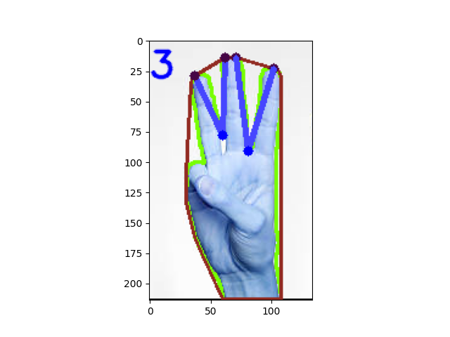
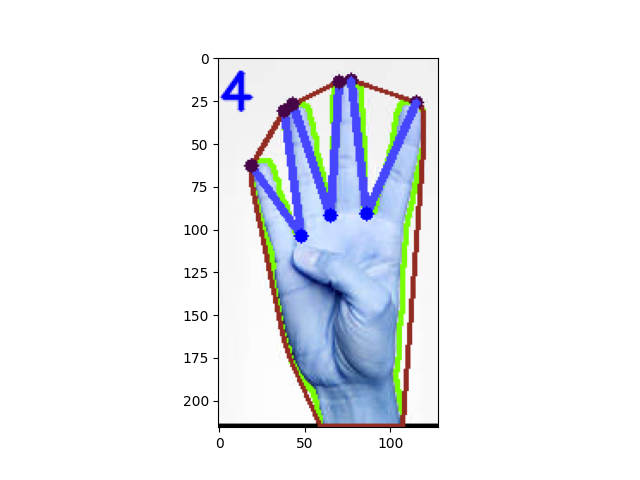

# Hand-Finguer-Count-Python
Presentation of an approach and an algorithm for recognizing of hand signs (Count from 1 to 5).

In this projrct we are presenitng an approach and an algorithm for the recognizinig hand sign based on cosinus theorem.

In this case we will propose a structural approach which does not depend on Machine learning, which will allow us to recognize hand signs. (The
digits from 1 to 5.)

To ensure the correct detection of fingers and to succeed in counting them, we worked to find the best segmentation method to isolate the hand from the background.

For this we applied:

1. Binary segmentation.
2. HSV Segmentation.
3. Segmentation by YCbCr Color Space.

Then we chose the best combination between this methods to get the best results.

Results : 

, ,  , ,  

